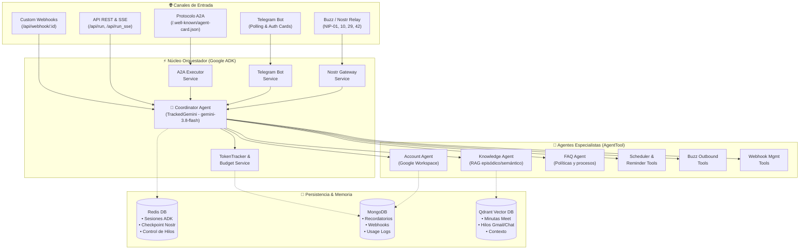
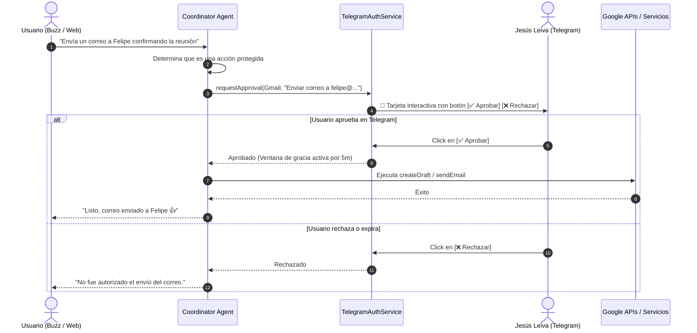

# 🤖 Yisus Agent

> **Clon digital y asistente ejecutivo y operacional de Jesús Leiva (CTO de Apprecio)**  
> Construido sobre **Google ADK (Agent Development Kit)**, **TypeScript**, **Nostr (Buzz)**, **Telegram**, **MongoDB**, **Redis** y **Qdrant Vector DB**.

---

## 📋 Tabla de Contenidos
1. [Visión General](#-visión-general)
2. [Arquitectura del Sistema](#-arquitectura-del-sistema)
3. [Flujo de Ejecución y Autorización](#-flujo-de-ejecución-y-autorización)
4. [Canales de Comunicación](#-canales-de-comunicación)
5. [Agentes y Herramientas](#-agentes-y-herramientas)
6. [Memoria y Recuperación (RAG)](#-memoria-y-recuperación-rag)
7. [Servicios en Segundo Plano & Cron Jobs](#-servicios-en-segundo-plano--cron-jobs)
8. [Token Tracker y Control de Presupuesto](#-token-tracker-y-control-de-presupuesto)
9. [Instalación y Puesta en Marcha](#-instalación-y-puesta-en-marcha)
10. [Variables de Entorno](#-variables-de-entorno)
11. [Scripts Disponibles](#-scripts-disponibles)

---

## 🧠 Visión General

**Yisus** representa el criterio técnico, estilo directo y capacidad operativa de **Jesús Leiva**. No es un bot convencional de atención al cliente ni un asistente genérico:
- **Tono auténtico y natural**: Escribe con el estilo conversacional habitual de Jesús en WhatsApp/Slack (directo, breve, informal, sin muletillas corporativas como "¿en qué te puedo colaborar?").
- **Identidad transparente**: Si se le pregunta directamente, aclara que es un agente digital y puede escalar decisiones al Jesús real.
- **Firma ejecutiva en correos**: Todos los borradores y correos en Gmail se redactan y firman estrictamente como **Jesús Leiva** (o *Jesús Leiva | CTO Apprecio*).
- **Operación multi-canal**: Se conecta simultáneamente a salas de trabajo descentralizadas en **Buzz (Nostr)**, bots privados en **Telegram**, agentes de IA mediante el protocolo **A2A**, y APIs REST/SSE.

---

## 🏛️ Arquitectura del Sistema



---

## 🔄 Flujo de Ejecución y Autorización

Para acciones críticas (como enviar correos en Gmail, agendar eventos o publicar mensajes en canales corporativos), el agente solicita confirmación explícita mediante **Tarjetas Interactivas en Telegram**:



---

## 📡 Canales de Comunicación

### 1. Nostr Gateway (Buzz Bridge)
Permite al agente interactuar en salas y canales descentralizados de **Buzz** (`wss://apprecio.communities.buzz.xyz`):
* **Protocolos Nostr**:
  * **NIP-01**: Sincronización de perfil de Yisus (Kind 0: avatar, display name, biografía).
  * **NIP-10 & NIP-29**: Respuestas en hilos de conversación y eventos de canal de grupo (Kind 9).
  * **NIP-42**: Autenticación criptográfica obligatoria con firma del reto mediante clave privada `nsec`.
* **Resiliencia & Conectividad**:
  * Implementación WebSocket nativa con protocolo `ws` (soporta ping/pong real a nivel de frame, evitando caídas silenciosas).
  * **Watchdog activo**: Envío periódico de pruebas y renovación programada de suscripción.
  * **Cola de respuestas pendientes**: Si el socket se desconecta mientras el modelo procesa una respuesta, el mensaje se encola y se despacha inmediatamente tras la reconexión.
  * **Memoria de Hilos en Redis**: Seguimiento continuo de conversaciones en hilos activos, permitiendo responder preguntas de seguimiento sin necesidad de volver a escribir `@Yisus`.

### 2. Telegram Bot
* **Modos**: Long Polling o Webhook.
* **Funciones**:
  * Interfaz de conversación privada directa con Jesús.
  * Panel de autorización de herramientas protegidas (*Human-in-the-loop*).
  * Envío proactivo de recordatorios y del **Morning Digest** matutino.
  * Menú de *Quick Actions* para consultas rápidas de agenda y estado del sistema.

### 3. Protocolo A2A (Agent-to-Agent)
* Endpoint compatible con el estándar **A2A v1**.
* Expone la tarjeta de capacidades del agente en `/.well-known/agent-card.json`.
* Permite a otros agentes del ecosistema (como Perseo, Tulio, NachoBot o A2) coordinar tareas a través de `/a2a/v1`.

### 4. API REST & SSE (Server-Sent Events)
* `POST /api/run`: Ejecución directa de prompts con respuesta JSON completa.
* `GET /api/run_sse`: Streaming en tiempo real de eventos del agente vía SSE.
* `GET /api/usage`: Métricas de consumo de tokens y costos en USD.
* `GET /api/usage/budget` & `POST /api/usage/budget`: Consulta y configuración dinámica de presupuestos por canal compatible con la interfaz gráfica **Leygo GUI**.

---

## 🛠️ Agentes y Herramientas

| Componente | Tipo | Descripción |
| :--- | :--- | :--- |
| **`Coordinator`** | `LlmAgent` | Agente raíz. Gestiona el contexto, define la personalidad y rutea tareas a especialistas. |
| **`accountAgent`** | `AgentTool` | Integración profunda con **Google Workspace**: Gmail (lectura, borradores, envío), Calendar (eventos, agenda diaria), Drive (búsqueda de archivos y transcripciones) y Google Chat. |
| **`knowledgeAgent`**| `AgentTool` | RAG episódico sobre **Qdrant**: consulta transcripciones de reuniones pasadas, acuerdos y contexto histórico de hilos. |
| **`faqAgent`** | `AgentTool` | Respuestas sobre lineamientos de la empresa, políticas internas y preguntas frecuentes. |
| **`schedulerTools`**| `Tools` | Programación, listado y cancelación de recordatorios diferidos. Disparo manual del Morning Digest. |
| **`nostrTools`** | `Tools` | Envío proactivo de mensajes a canales de Buzz (`buzz_send_message`) y verificación del estado del bridge (`buzz_status`). |
| **`webhookTools`** | `Tools` | Creación y administración de webhooks inteligentes con procesamiento de IA. |
| **`usageTools`** | `Tools` | Monitoreo de tokens consumidos, consulta de presupuestos y actualización de tarifas de modelos. |

---

## 🔍 Memoria y Recuperación (RAG)

El agente utiliza **Qdrant** como almacén vectorial con colecciones optimizadas:
* **Colección `episodic_memory`**:
  * Indexa minutas de reuniones de Google Meet generadas por Gemini.
  * Almacena metadatos críticos: participantes, decisiones tomadas, tareas asignadas, enlaces a documentos de Drive y fecha.
* **Colección `context_memory`**:
  * Almacena hilos consolidados de Gmail y Google Chat.
* **Embeddings soportados**:
  * **Ollama local/remoto** (`nomic-embed-text:latest`) por defecto.
  * **Google Gemini** (`gemini-embedding-001`) como proveedor alternativo configurable.

---

## ⏰ Servicios en Segundo Plano & Cron Jobs

El `SchedulerService` orquesta automáticamente las siguientes rutinas periódicas:

```mermaid
flowchart LR
    Cron["node-cron Engine"]
    
    Cron -->|08:30 CLT (Lun-Vie)| Digest["Morning Digest\n• Agenda Google Calendar\n• Correos prioritarios\n• Notificación a Telegram"]
    Cron -->|20:00 CLT (Lun-Vie)| Meet["Meet Ingest Sync\n• Revisa Drive\n• Extrae notas de Gemini\n• Upsert en Qdrant"]
    Cron -->|21:00 CLT (Lun-Vie)| Context["Context Consolidation\n• Hilos Gmail & Chat\n• Resúmenes vectoriales"]
    Cron -->|03:00 CLT (Domingos)| Pricing["LiteLLM Pricing Updater\n• Sincroniza tarifas\nde 2,000+ modelos"]
```

---

## 💰 Token Tracker y Control de Presupuesto

Cada invocación del modelo Gemini (`TrackedGemini`) registra detalladamente el uso en MongoDB y memoria:
* **Canales monitoreados**: `telegram`, `buzz`, `a2a`, `api`, `system`.
* **Presupuestos independientes**: Se pueden definir límites mensuales en dólares para cada canal (por ejemplo: $5 USD global, $3 USD Buzz, $2 USD Telegram).
* **Alerta de umbrales**: Notifica cuando el consumo se acerca o supera el límite configurado.

---

## 🚀 Instalación y Puesta en Marcha

### 1. Requisitos Previos
* **Node.js** >= 20.x
* **Docker & Docker Compose** (para ejecutar Redis, MongoDB y Qdrant localmente)

### 2. Infraestructura Base
Si no cuentas con instancias existentes, puedes iniciar las bases de datos requeridas:
```bash
# Redis (puerto 6379)
docker run -d --name redis-yisus -p 6379:6379 redis:alpine

# MongoDB (puerto 27017)
docker run -d --name mongo-yisus -p 27017:27017 mongo:7

# Qdrant Vector DB (puerto 6333)
docker run -d --name qdrant-yisus -p 6333:6333 -v $(pwd)/qdrant_storage:/qdrant/storage qdrant/qdrant
```

### 3. Instalación de Dependencias
```bash
git clone <url-del-repositorio>
cd yisus-agent
npm install
```

### 4. Configurar Variables de Entorno
Copia el archivo de ejemplo y completa las credenciales:
```bash
cp .env.example .env
```

### 5. Generar o Verificar Identidad Nostr
Para interactuar con Buzz, el bot necesita su par de claves criptográficas:
```bash
npm run nostr:id
```
*(Esto creará `.nostr_keys.json` con la clave privada `nsec` y pública `npub`, excluido por seguridad en `.gitignore`)*.

### 6. Ejecutar en Modo Desarrollo
```bash
npm run dev
```

---

## 🔐 Variables de Entorno

A continuación se resumen las variables clave del archivo `.env`:

```ini
# Configuración del Servidor
PORT=4000
NODE_ENV=development
ADK_APP_NAME=yisus

# Base de Datos Redis
REDIS_HOST=localhost
REDIS_PORT=6379
REDIS_DB=0

# Base de Datos MongoDB
MONGO_URI=mongodb://localhost:27017/yisus_agent

# Proveedor de IA (Google Gemini)
GEMINI_API_KEY=AIzaSy...

# Qdrant Vector DB & Embeddings
QDRANT_URL=http://localhost:6333
EMBEDDING_PROVIDER=ollama
OLLAMA_BASE_URL=https://ollama.openip.cl
OLLAMA_EMBED_MODEL=nomic-embed-text:latest

# Telegram Bot
TELEGRAM_BOT_TOKEN=123456789:ABCdef...
TELEGRAM_CHAT_ID=987654321

# Nostr Gateway (Buzz)
NOSTR_ENABLED=true
NOSTR_RELAY_URL=wss://apprecio.communities.buzz.xyz
NOSTR_CHANNELS=3ebb4231-e162-477e-ad68-bdc568c5d3d5
NOSTR_REQUIRE_MENTION=true
NOSTR_RESUBSCRIBE_SECONDS=30

# Google Workspace (OAuth2)
GOOGLE_CLIENT_ID=...apps.googleusercontent.com
GOOGLE_CLIENT_SECRET=GOCSPX-...
GOOGLE_REFRESH_TOKEN=1//04...

# Control de Presupuesto (USD)
MONTHLY_BUDGET_USD=5
MONTHLY_BUDGET_USD_BUZZ=3
MONTHLY_BUDGET_USD_TELEGRAM=2
```

---

## 📜 Scripts Disponibles

* `npm run dev`: Inicia el servidor en modo desarrollo con recarga en caliente (`tsx watch`).
* `npm run build`: Compila el proyecto TypeScript hacia JavaScript en `./dist`.
* `npm start`: Ejecuta la versión compilada en producción.
* `npm run nostr:id`: Muestra las llaves Nostr del agente o genera un nuevo par seguro.
* `npm run sync:meet`: Ejecuta manualmente la sincronización de minutas de Google Meet hacia Qdrant.
* `npm run sync:context`: Dispara la consolidación manual de hilos de Gmail y Google Chat.
* `npm run sync:obsidian`: Sincroniza notas de conocimiento local en Obsidian hacia Qdrant.

---

<p align="center">
  <b>Yisus Agent</b> • Diseñado para la eficiencia técnica y ejecutiva de Apprecio.
</p>
