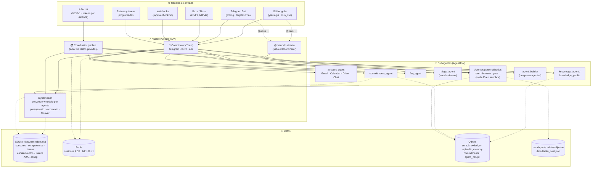
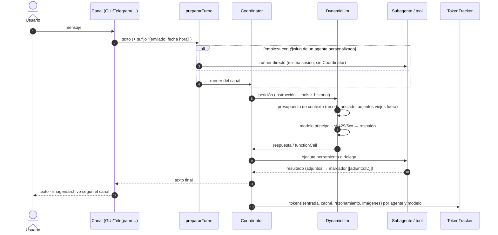
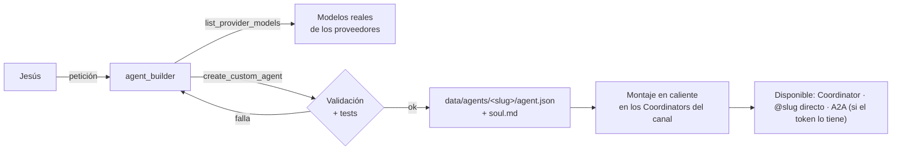
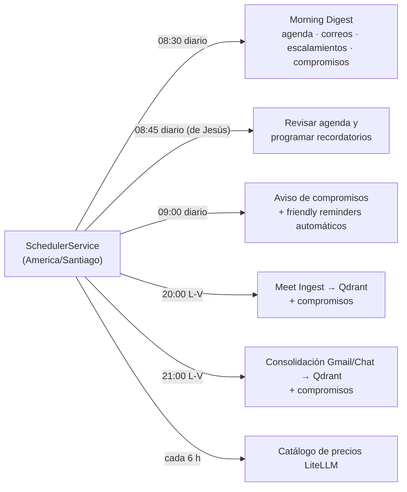

# 🤖 Yisus Agent

> **Clon digital y asistente ejecutivo de Jesús Leiva (CTO de Apprecio).**
> Backend multi-agente en **TypeScript** sobre **Google ADK**, con **GUI Angular** (`yisus-gui`), canales **Telegram · Buzz (Nostr) · A2A · API**, memoria en **Qdrant**, estado en **SQLite + Redis**, y proveedores LLM intercambiables (Gemini, OpenAI, Anthropic, Moonshot, xAI, DeepSeek, Groq, Mistral, OpenRouter, Ollama).

---

## 📋 Tabla de contenidos

1. [Visión general](#-visión-general)
2. [Arquitectura](#-arquitectura)
3. [Cómo se procesa un turno](#-cómo-se-procesa-un-turno)
4. [Canales](#-canales)
5. [Agentes y herramientas](#-agentes-y-herramientas)
6. [Self agents: agentes creados por IA](#-self-agents-agentes-creados-por-ia)
7. [Adjuntos (imágenes y archivos)](#-adjuntos-imágenes-y-archivos)
8. [Compromisos](#-compromisos)
9. [Memoria (RAG)](#-memoria-rag)
10. [Rutinas y tareas programadas](#-rutinas-y-tareas-programadas)
11. [Modelos LLM: proveedores, asignación y respaldo](#-modelos-llm-proveedores-asignación-y-respaldo)
12. [Costos: medición y presupuesto](#-costos-medición-y-presupuesto)
13. [Seguridad](#-seguridad)
14. [GUI (yisus-gui)](#-gui-yisus-gui)
15. [Instalación](#-instalación)
16. [Variables de entorno](#-variables-de-entorno)
17. [Scripts](#-scripts)
18. [Estructura del repositorio](#-estructura-del-repositorio)

---

## 🧠 Visión general

**Yisus** representa el criterio técnico, el estilo directo y la capacidad operativa de Jesús:

- **Tono propio**: escribe como Jesús en WhatsApp/Slack (directo, breve, sin muletillas corporativas). Si le preguntan, aclara que es un agente y escala al Jesús real lo que corresponde.
- **Un Coordinator, muchos especialistas**: el Coordinator entiende, rutea y responde; los subagentes (cuenta Google, conocimiento, FAQ, triage, compromisos, agentes personalizados) hacen el trabajo.
- **Human-in-the-loop**: las acciones sensibles (enviar correos, publicar en Buzz, resolver escalamientos) piden confirmación por Telegram; lo que otros deciden por Jesús se registra como *escalamiento*.
- **Multi-canal con permisos por canal**: cada canal monta su propio set de herramientas (`config/channels.json`); por A2A cada token tiene su alcance.
- **Costos bajo control**: cada llamada al modelo se mide (tokens, caché, razonamiento, imágenes) y se tarifa con precios reales; hay presupuestos por canal y modelo de respaldo si el principal falla.

---

## 🏛️ Arquitectura



**Reglas que sostienen el diseño**

- El Coordinator de cada canal se construye con las herramientas de ese canal (`config/channels.json`) **más** los agentes personalizados que declaran ese canal en su manifiesto, sin repetir nombres.
- El Coordinator público (A2A) no tiene acceso a Gmail/Calendar/Drive ni a los compromisos de escritura; cada token A2A recibe además un subconjunto de herramientas.
- Los subagentes corren sin historial (`includeContents: 'none'`): reciben la consulta, responden, y no arrastran contexto entre turnos. Es lo que los hace baratos.

---

## 🔄 Cómo se procesa un turno



Detalles que importan:

- **Fecha y hora** viajan en el mensaje del usuario, no en la instrucción: así instrucción + herramientas + historial son un prefijo estable y Gemini reutiliza el **caché de prompt** (~90 % de descuento en esos tokens).
- **Presupuesto de contexto** (`src/agents/llm/context_budget.ts`): respuestas de herramientas acotadas por tool, ventana de historial por agente (Coordinator 90k chars) con corte **anclado** (no se mueve en cada turno), marcadores de adjuntos de turnos anteriores neutralizados.
- **Sesiones**: GUI y API usan una sesión por conversación; Telegram abre una nueva tras 4 h sin mensajes (`TELEGRAM_SESSION_IDLE_MIN`) o con `/nueva`; las tareas programadas usan sesión nueva en cada corrida; A2A usa el `contextId` del cliente y procesa **un turno a la vez** por contexto.

---

## 📡 Canales

| Canal | Entrada | Particularidades |
| :--- | :--- | :--- |
| **GUI** (`yisus-gui`) | `POST /run_sse` (SSE) | Streaming de eventos, pasos por agente, costo por turno, adjuntos inline, `@agente` con autocompletado, editar/reenviar/regenerar (rebobina la sesión del backend). |
| **Telegram** | long polling | Chat privado con Jesús, tarjetas de autorización (2FA de herramientas), recordatorios y avisos, fotos/documentos generados, `/nueva`. |
| **Buzz (Nostr)** | relay `wss://…buzz.xyz` | NIP-01/10/29/42, watchdog y cola de reenvío. Responde con mención (`@Yisus`, sin contar URLs/dominios) o en hilos activos **solo a sus interlocutores** y nunca a mensajes dirigidos a otro (`@NachoBot …`). |
| **A2A 1.0** | `POST /a2a/v1` (JSON-RPC) | Card en `/.well-known/agent-card.json`. Tokens con alcance por herramienta (`Tokens A2A` en la GUI), peers remotos (Yisus como cliente A2A). Tareas terminan en `COMPLETED`; adjuntos como partes `url` y como artifact. |
| **Webhooks** | `POST /api/webhook/:id` | Webhooks personalizados con instrucción, proveedor/modelo propio y entrega a canales. |
| **API** | `/run`, `/run_sse`, `/api/*` | Protegida por `ADMIN_API_KEY` o sesión de la GUI (`admin_guard.ts`). `npm run check:rutas` verifica qué queda público. |

---

## 🛠️ Agentes y herramientas

| Agente | Rol |
| :--- | :--- |
| **`Coordinator`** (Yisus) | Raíz de los canales de Jesús. Personalidad, ruteo, respuesta final. Recibe la lista de agentes personalizados de forma dinámica (sin reiniciar). |
| **`public_coordinator`** | Raíz de A2A. Mismo criterio, sin datos privados; no ejecuta de nuevo lo ya hecho en la conversación. |
| **`account_agent`** | Google Workspace: Gmail, Calendar, Drive, Google Chat (con formato nativo de Chat). |
| **`knowledge_agent`** / **`knowledge_public`** | RAG sobre Qdrant: minutas, hilos consolidados, notas de Obsidian (la versión pública solo lo no confidencial). |
| **`faq_agent`** | Políticas, procesos y preguntas frecuentes de Apprecio. |
| **`triage_agent`** | Escalamientos: lo que no debe decidir el clon (sueldos, contrataciones, compromisos legales…) se registra y se le pregunta a Jesús; la respuesta vuelve a quien preguntó. |
| **`commitments_agent`** | Lista viva de compromisos (ver abajo). Escritura solo desde canales de Jesús. |
| **`agent_builder`** | Agente programador: crea y modifica agentes personalizados a partir de lenguaje natural. Solo desde canales de Jesús. |
| **Agentes personalizados** | `nami`, `banano`, `yutu`, … creados por el builder; ver siguiente sección. |

Los grupos de herramientas y su disponibilidad por canal viven en `src/agents/tool_catalog.ts` y `config/channels.json`, editables desde la GUI (*Canales y tools*).

---

## 🧩 Self agents: agentes creados por IA

Pídele al Coordinator (o usa *Agentes → Crear con IA* en la GUI):

> "Crea un agente que me ayude en los estudios de vuelo: convierte km a millas náuticas y calcula el top of descent. Se llama Nami y tiene la personalidad de un instructor de vuelo."



- **Manifiesto** (`agent.json`): nombre, personalidad (*soul*), descripción de ruteo, herramientas (JSON Schema + código JS + tests), variables de entorno, memoria propia, modelo, canales.
- **Sandbox**: el código de cada herramienta corre en un `worker_thread` con `node:vm` sin prototipos ni acceso a `require/process/fs`; `ctx.fetch` solo https y solo si la herramienta declara `network`; timeout duro (10 s, 90 s con red). Probado contra escapes y bucles infinitos.
- **Variables**: `AGENT_<SLUG>_<VAR>` en el `.env` (o `<VAR>` global), editables desde la GUI.
- **Memoria propia** opcional: colección `agent_<slug>` en Qdrant con `memory_search` / `memory_save`.
- **Modelos reales**: el builder consulta los modelos que ofrece cada proveedor antes de programar una herramienta que llame a un LLM/API (nunca adivina nombres).
- **Edición en línea** en la GUI: soul, herramientas (con prueba individual), variables, canales, modelo; "Probar" abre un chat directo con el agente; el progreso de la creación se ve en tiempo real.
- **Mención directa**: `@nami …` en GUI, API o Telegram va directo al agente, sin Coordinator, sobre la misma sesión (≈10× más barato). En Buzz y A2A decide el Coordinator.

---

## 🖼️ Adjuntos (imágenes y archivos)

Una herramienta devuelve `{ adjuntos: [{ tipo, mime, base64, nombre, caption }] }`. El sandbox lo guarda en `data/adjuntos/<id>` (id aleatorio de 128 bits, caduca a los 7 días) **antes** de que el resultado llegue al modelo, que solo ve una referencia con el marcador `[[adjunto:ID]]`. Cada canal lo convierte:

| Canal | Cómo llega |
| :--- | :--- |
| GUI | imagen inline / enlace |
| Telegram | `sendPhoto` / `sendDocument` (multipart) |
| Google Chat, Buzz | enlace público `https://<PUBLIC_BASE_URL>/api/adjuntos/<id>` |
| A2A | parte `{ url, filename, mediaType }` + artifact |

Las llamadas que una herramienta hace directamente a la API de Gemini (p. ej. `gemini-3.1-flash-image`) se miden igual: tokens e **imágenes por unidad**.

---

## ✅ Compromisos

Lista viva de lo que Jesús debe y lo que le deben, con estados `propuesto → pendiente → en_curso → hecho / cancelado / descartado`.

- **Fuentes**: consolidación nocturna de Gmail/Chat, ingesta de minutas de Meet, y a mano (chat, GUI). El backfill (`npm run commitments:backfill`) recorre la memoria episódica existente.
- **Sin duplicados**: candidatos por similitud léxica y semántica (Qdrant); los dudosos los decide una llamada al modelo por lote.
- **Fechas propuestas** según prioridad (alta +2, media +5, baja +10 días hábiles); Jesús acepta o cambia.
- **Notificaciones**: al cerrar, se elige el canal para avisar a la contraparte (Telegram, Google Chat, correo…); *friendly reminder* manual o automático para lo que le deben.
- **Digest**: el Morning Digest incluye la sección de compromisos; la rutina *Aviso de compromisos* (09:00) le avisa a Jesús lo que vence.
- Disponible en GUI (`/commitments`), Telegram, API, Buzz y A2A (solo lectura en canales externos).

---

## 🔍 Memoria (RAG)

Colecciones en **Qdrant** (embeddings con Ollama `nomic-embed-text` o `gemini-embedding-001`, `EMBEDDING_PROVIDER`):

| Colección | Contenido |
| :--- | :--- |
| `core_knowledge` | Conocimiento base: notas de Obsidian (`npm run sync:obsidian`), arquitectura y documentación de Apprecio. |
| `episodic_memory` | Minutas de Google Meet (participantes, decisiones, tareas, enlaces) e hilos consolidados de Gmail y Google Chat. |
| `commitments` | Índice semántico de compromisos (dedup y búsqueda). |
| `agent_<slug>` | Memoria propia de cada agente personalizado que la active. |

Qdrant Cloud exige índices de payload para filtrar; el servicio los crea al arrancar (`asegurarIndices`).

---

## ⏰ Rutinas y tareas programadas

Todo vive en **Tareas programadas** (GUI `/tasks`): las rutinas de sistema (registradas por código, no se borran), las tareas creadas por Jesús (desde el chat o la GUI, con proveedor/modelo propio y entrega a canales) y una pestaña de finalizadas.



Cada corrida abre una sesión nueva (una tarea diaria no arrastra el historial de las anteriores).

---

## 🧮 Modelos LLM: proveedores, asignación y respaldo

- **Proveedores** (GUI *Ajustes → Proveedores LLM*): Gemini, OpenAI, Anthropic, xAI, Moonshot (Kimi), DeepSeek, Groq, Mistral, OpenRouter, Ollama y cualquier API compatible con OpenAI. Claves enmascaradas, prueba de conexión, lista de modelos desde la API del proveedor.
- **Asignación por agente** (*Modelos por agente*): cada agente (Coordinator, subagentes, digest, consolidación, ingesta, webhooks, tareas) resuelve proveedor+modelo **en cada llamada** desde `system_config`; cambia sin reiniciar. Los adaptadores propios (`src/agents/llm/`) implementan function calling, contabilidad de tokens y reintentos ante 429/5xx.
- **Respaldo (failover)**: un modelo de respaldo global y/o por agente. Si el principal falla con un error transitorio (429, 5xx, "high demand", "unavailable", red), la misma petición se repite con el respaldo dentro del mismo turno. No reintenta errores de petición, de clave ni de modelo inexistente. Conviene que el respaldo sea de **otro** proveedor.
- **Override por ejecución**: tareas programadas y webhooks pueden fijar su propio modelo para el Coordinator.

---

## 💰 Costos: medición y presupuesto

- Cada llamada al modelo se registra en SQLite (`usage_history`) por **canal, agente y modelo**, con tokens de entrada, **en caché**, de salida, de **razonamiento**, **imágenes generadas**, número de llamadas del turno y las herramientas invocadas.
- **Precios**: manual (GUI *Consumo → Precios por modelo*) → catálogo **LiteLLM** (se refresca a diario, busca `<proveedor>/<modelo>`) → familia → default. Cada fila guarda la fuente; lo aproximado se marca con ≈. "Retarifar mes" recalcula con los precios vigentes.
- **Presupuestos** mensuales en USD, global y por canal, con alertas.
- El tooltip de cada turno en el chat muestra tokens, caché, razonamiento y costo por agente.

---

## 🔐 Seguridad

- `ADMIN_API_KEY` o sesión de la GUI (usuario + hash scrypt, `npm run gui:password`) para `/run`, `/run_sse`, `/api/*` y la administración; `npm run check:rutas` comprueba que nada sensible quede abierto.
- A2A: tokens `yisus_…` con alcance por herramienta (`npm run check:permisos`); la clave de administración **nunca** viaja por A2A.
- Herramientas protegidas piden confirmación por Telegram (`npm run check:2fa`); Buzz y A2A no pueden crear agentes ni modificar compromisos.
- Código de agentes personalizados aislado en sandbox (ver arriba).
- Los adjuntos son URLs-capacidad (id aleatorio, caducan); nada de claves en las URLs.
- Secretos solo en `.env` (ignorado por git); los manifiestos de agentes no contienen claves.

---

## 🖥️ GUI (yisus-gui)

Angular 21 (zoneless, signals). Vistas: **Chat** (streaming, pasos, costos, adjuntos, `@agente`, editar/regenerar), **Consumo** (turnos, precios, presupuestos), **Canales y tools**, **Tokens A2A** (tokens y peers remotos), **Escalamientos**, **Compromisos**, **Agentes** (self agents), **Webhooks**, **Tareas programadas**, **Ajustes** (proveedores LLM, modelos por agente con respaldo, claves y variables del `.env`, reinicio). Funciona en móvil (teclado iOS, sidebar con scroll).

```bash
cd yisus-gui && npm install && npx ng build --watch --configuration development   # sirve dist/yisus-gui/browser
```

> Si la GUI se sirve detrás de Cloudflare, crea una regla *Bypass cache* para el host: si no, cada deploy requiere recarga forzada.

---

## 🚀 Instalación

**Requisitos**: Node.js ≥ 22 (usa `node:sqlite` nativo), Redis, Qdrant (local o Cloud), MongoDB (solo para el FAQ de Apprecio), opcionalmente Ollama para embeddings.

```bash
# Infraestructura local
docker run -d --name redis-yisus  -p 6379:6379 redis:alpine
docker run -d --name qdrant-yisus -p 6333:6333 -v $(pwd)/qdrant_storage:/qdrant/storage qdrant/qdrant
docker run -d --name mongo-yisus  -p 27017:27017 mongo:7

# Backend
git clone <url-del-repositorio> && cd yisus-agent
npm install
cp .env.example .env            # completa claves
npm run nostr:id                # identidad Nostr (Buzz)
npm run google:oauth            # refresh token de Google Workspace
npm run gui:password            # usuario/contraseña de la GUI
npm run dev                     # tsx watch src/index.ts (puerto 4000)
```

La primera vez, el catálogo de precios se descarga solo; `data/` se crea con SQLite, agentes y adjuntos.

---

## 🔐 Variables de entorno

Las principales (ver `.env.example` para la lista completa):

```ini
# Servidor
PORT=4000
ADK_APP_NAME=yisus
DATA_DIR=                       # carpeta absoluta de datos (por defecto ./data)
PUBLIC_BASE_URL=https://yisus.openip.cl   # base pública de la API (adjuntos, A2A); si falta usa A2A_BASE_URL
SCHEDULER_TZ=America/Santiago

# Modelos
GEMINI_API_KEY=                 # Gemini por defecto; los demás proveedores se configuran en la GUI
AGENT_<SLUG>_<VAR>=             # variables de agentes personalizados (p. ej. AGENT_BANANO_GEMINI_API_KEY)

# Datos
REDIS_HOST=localhost
REDIS_PORT=6379
QDRANT_URL=http://localhost:6333
QDRANT_API_KEY=
MONGO_URI=mongodb://localhost:27017/appLucia
EMBEDDING_PROVIDER=ollama       # ollama | gemini
OLLAMA_BASE_URL=http://localhost:11434
OLLAMA_EMBED_MODEL=nomic-embed-text:latest

# Google Workspace (OAuth2)
GOOGLE_CLIENT_ID=
GOOGLE_CLIENT_SECRET=
GOOGLE_REFRESH_TOKEN=
GOOGLE_REDIRECT_URI=

# Telegram
TELEGRAM_TOKEN=
TELEGRAM_CHAT_ID=
TELEGRAM_SESSION_IDLE_MIN=240   # sesión nueva tras N minutos sin mensajes

# Buzz (Nostr)
NOSTR_ENABLED=true
NOSTR_RELAY_URL=wss://apprecio.communities.buzz.xyz
NOSTR_PRIVATE_KEY=
NOSTR_CHANNELS=
NOSTR_REQUIRE_MENTION=true

# A2A
A2A_API_KEY=                    # sin esta clave /a2a/v1 no se monta
A2A_BASE_URL=https://yisus.openip.cl

# Administración y GUI
ADMIN_API_KEY=
GUI_ORIGIN=https://gui-yisus.openip.cl,http://localhost:4200
GUI_USER=
GUI_PASSWORD_HASH=

# Presupuestos (USD/mes)
MONTHLY_BUDGET_USD=10
MONTHLY_BUDGET_USD_TELEGRAM=2
MONTHLY_BUDGET_USD_BUZZ=3
MONTHLY_BUDGET_USD_A2A=3
```

---

## 📜 Scripts

| Script | Qué hace |
| :--- | :--- |
| `npm run dev` / `build` / `start` | Desarrollo con recarga (`tsx watch`) / compilar / producción. |
| `npm run nostr:id` | Muestra o genera la identidad Nostr del agente. |
| `npm run google:oauth` | Flujo OAuth para obtener el refresh token de Google Workspace. |
| `npm run gui:password` | Genera el hash de contraseña de la GUI. |
| `npm run sync:meet` / `sync:context` / `sync:obsidian` | Ingestas manuales hacia Qdrant. |
| `npm run commitments:backfill` | Extrae compromisos de la memoria episódica existente. |
| `npm run check:rutas` / `check:permisos` / `check:2fa` | Verificaciones de seguridad (rutas públicas, alcance de tokens A2A, herramientas con 2FA). |

---

## 🗂️ Estructura del repositorio

```
src/
  agents/            Coordinator, público, subagentes, catálogo de tools
    llm/             adaptadores (OpenAI-compatible, Anthropic), DynamicLlm, presupuesto de contexto
    custom/          self agents: servicio, sandbox (worker + vm)
    tools/           herramientas por dominio (google, commitments, builder, …)
  a2a/               servidor A2A (card, executor, helpers)
  services/          telegram, nostr, scheduler, tareas, compromisos, adjuntos, precios, sesiones Redis…
  routes/            API REST (index, admin, settings, commitments, agents) y guard
  database/          SQLite (node:sqlite) y Mongo
  utils/             usage_collector (medición por turno), fecha, logger ADK
config/channels.json herramientas por canal
data/                SQLite, agentes personalizados, adjuntos, catálogo de precios (parcialmente ignorado por git)
docs/openclaw/       skill para que OpenClaw consuma a Yisus por A2A
scripts/             utilidades y verificaciones
yisus-gui/           GUI Angular
TODO.md              estado del proyecto y pendientes
```

---

<p align="center"><b>Yisus Agent</b> · Diseñado para la eficiencia técnica y ejecutiva de Apprecio.</p>
