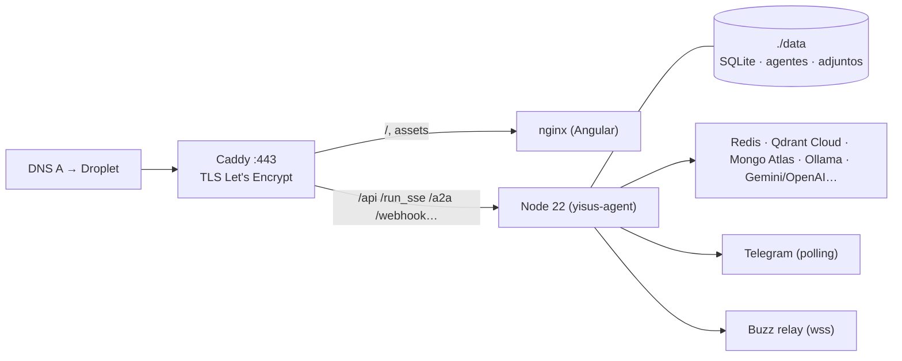

# Despliegue en DigitalOcean (Droplet + Docker Compose)

Un solo Droplet corre el backend (Node 22), la GUI (nginx) y Caddy (TLS automático) bajo **un dominio**:
`https://<DOMAIN>/` es la GUI y `https://<DOMAIN>/api`, `/run_sse`, `/a2a/v1`, `/.well-known/agent-card.json`, `/webhook…` es la API.
Redis, Qdrant, Mongo y Ollama siguen siendo los servicios externos que ya usas (`.env`).



## 0. Antes de empezar

- **Solo puede haber UNA instancia viva**: Telegram (polling), Buzz (misma identidad Nostr) y las rutinas programadas se duplican si el Mac y el servidor corren a la vez. El día del corte: apaga el `npm run dev` local.
- Droplet recomendado: **Ubuntu 24.04, 2 vCPU / 4 GB** (Basic, ~US$24/mes). 2 GB funciona, pero la generación de imágenes mueve base64 de varios MB y Angular se compila en el propio Droplet.
- Dominio: un registro **A** `yisus.tudominio.cl → IP del Droplet`. Si lo pones detrás de Cloudflare (proxy naranja), usa modo SSL *Full (strict)*; con `index.html` en `no-cache` no hace falta regla de Bypass.

## 1. Crear el Droplet

DigitalOcean → Create → Droplet → Ubuntu 24.04 → tamaño → **SSH key** (no password) → región cercana (`sfo3`/`nyc3`; `sao1` si quieres latencia a Chile). Activa *Monitoring*. Crea también un **Cloud Firewall** con entrada 22 (solo tu IP), 80 y 443, y asígnalo al Droplet.

## 2. Preparar el servidor (una vez)

```bash
ssh root@<IP>
curl -fsSL https://raw.githubusercontent.com/<tu-usuario>/yisus-agent/main/deploy/setup-droplet.sh | bash
# instala Docker + Compose, ufw (22/80/443), fail2ban, updates automáticos y el usuario "yisus"
```

## 3. Código y configuración

```bash
su - yisus
git clone git@github.com:<tu-usuario>/yisus-agent.git   # o https con token
cd yisus-agent
```

Copia el `.env` de tu Mac (es el mismo: todos los servicios son externos) y ajusta estas líneas:

```ini
DOMAIN=yisus.tudominio.cl                 # lo usa Caddy para el certificado
PUBLIC_BASE_URL=https://yisus.tudominio.cl
A2A_BASE_URL=https://yisus.tudominio.cl
GUI_ORIGIN=https://yisus.tudominio.cl     # mismo origen: CORS deja de importar, pero queda bien puesto
DATA_DIR=/app/data                        # ruta DENTRO del contenedor (volumen ./data)
NODE_ENV=production
```

Y copia los datos de tu Mac (base SQLite, agentes personalizados, catálogo de precios):

```bash
# en el Mac
rsync -av --exclude adjuntos ~/…/yisus-agent/data/ yisus@<IP>:~/yisus-agent/data/
rsync -av ~/…/yisus-agent/config/channels.json yisus@<IP>:~/yisus-agent/config/
```

## 4. Levantar

```bash
./deploy/deploy.sh          # build de las imágenes + docker compose up -d
docker compose logs -f agent
```

Caddy pide el certificado solo (el DNS ya debe apuntar al Droplet). Prueba:

- `https://<DOMAIN>/api/status` → `{ status: "ok", protegido: true }`
- `https://<DOMAIN>/` → login de la GUI (usuario/contraseña del `.env`)
- `https://<DOMAIN>/.well-known/agent-card.json` → tarjeta A2A

Después del corte: en la GUI del Mac, si tenías `yisus_api_url` guardado, bórralo (Ajustes) — en producción la GUI usa el mismo origen. Actualiza en OpenClaw y en los peers A2A la URL nueva.

## 5. Operación

| Qué | Cómo |
| :--- | :--- |
| Actualizar | `./deploy/deploy.sh` (git pull + rebuild + restart; los datos están en `./data`) |
| Logs | `docker compose logs -f agent` (rotan solos: 5 × 20 MB) |
| Reiniciar solo el backend | `docker compose restart agent` (o Ajustes → Reiniciar en la GUI) |
| Respaldo diario | `crontab -e` → `15 3 * * * /home/yisus/yisus-agent/deploy/backup.sh >> /home/yisus/backup.log 2>&1` (deja `~/backups/yisus-<fecha>.tar.gz`, 14 días). Para copia fuera del Droplet: `rclone`/`s3cmd` a un Space, o activa *Backups* semanales del Droplet (20 % del precio). |
| Salud | Docker reinicia el backend si `/api/status` deja de responder (healthcheck). Para avisos externos, un monitor HTTP (UptimeRobot / DO Uptime) sobre `https://<DOMAIN>/api/status`. |
| Certificado | Caddy lo renueva solo. |

## 6. Checklist de seguridad antes de anunciar la URL

- [ ] `ADMIN_API_KEY` larga y distinta a la de desarrollo; `GUI_PASSWORD_HASH` regenerado (`npm run gui:password`).
- [ ] `npm run check:rutas` y `npm run check:permisos` en verde (se pueden correr con `docker compose exec agent npx tsx scripts/…`).
- [ ] Tokens A2A revisados: cada uno con el alcance mínimo; regenerar los que se usaron en pruebas.
- [ ] `NOSTR_ALLOWED_PUBKEYS` acotado si Buzz no debe responder a cualquiera.
- [ ] Presupuestos mensuales (`MONTHLY_BUDGET_USD*`) y modelo de respaldo configurados.
- [ ] El `.env` solo existe en el servidor y en tu gestor de contraseñas; nunca en el repo.

## Qué NO hace falta

- Kubernetes, App Platform ni balanceadores: es un proceso, un usuario, un dominio.
- Base de datos gestionada: SQLite en el volumen es suficiente para este volumen de datos; el respaldo diario cubre el riesgo.
- Cloudflare Tunnel: Caddy expone 443 directo con TLS válido.
